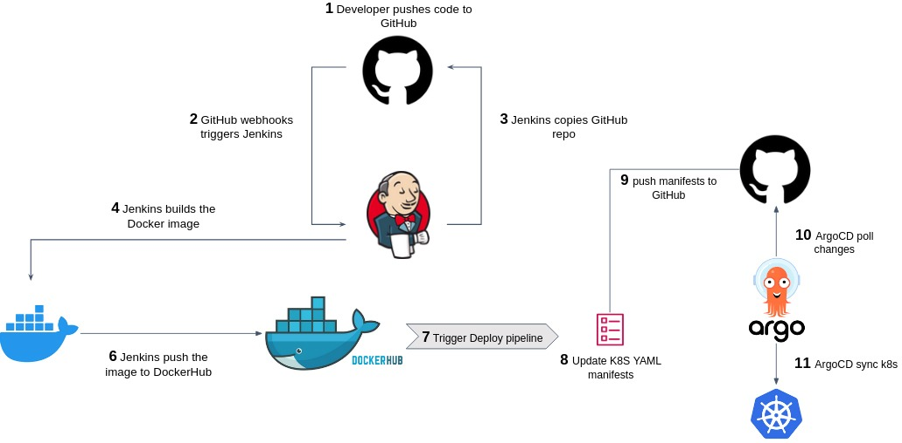

# GitHub Actions, Jenkins and ArgoCD

## GitHub Actions
GitHub Actions is a powerful CI/CD (Continuous Integration and Continuous Deployment) platform that allows you to automate tasks and workflows for your project directly in GitHub. You can define workflows to build, test, and deploy code based on events such as commits, pull requests, or manually triggered actions.

#### Key Concepts of GitHub Actions:
- Workflows:  
Workflows are automated processes defined in YAML files. These are stored in the .github/workflows/ directory of your repository. Each workflow file can contain multiple jobs and steps to perform different actions.
- Triggers (Events): Workflows are triggered by specific events in your repository. Some common triggers include:
  - push: Runs a workflow when code is pushed to the repository.
  - pull_request: Runs when a pull request is opened, updated, or merged.
  - workflow_dispatch: Allows for manual workflow execution.
- Jobs:  
A workflow consists of one or more jobs. Each job runs in an isolated virtual machine (runner). Jobs within a workflow can run sequentially or in parallel.
- Steps:  
Jobs are made up of steps. A step can either be a shell command or an action (reusable components). Steps define what each job should do, like running scripts, installing dependencies, or deploying code.
- Actions:  
Actions are reusable, pre-configured scripts that you can use within your workflows to perform common tasks like setting up a particular programming environment, running tests, deploying code, etc. You can use actions from the GitHub Marketplace or create custom ones for your own projects.
- Runners:  
GitHub provides runners, which are the machines that execute your jobs. GitHub-hosted runners come pre-installed with tools, while self-hosted runners are machines you manage.

## CI/CD Pipeline with GitHub Actions

### Continuous Integration (CI) in GitHub Actions
Continuous Integration (CI) in GitHub Actions focuses on testing and verifying code changes automatically every time new code is committed to a repository. The typical CI process includes the following steps:

#### 1. Triggering the Workflow:  
When developers push code changes or open a pull request, GitHub Actions is triggered. A workflow file, stored in the .github/workflows/ directory, defines what actions need to be taken when specific events occur (e.g., push, pull request).

#### 2. Running Tests: 
GitHub Actions then spins up a runner (a virtual machine or container) and starts executing the pipeline. This could include setting up the environment (e.g., installing dependencies or setting up language-specific tools), running unit and integration tests, or checking code quality using linters. The purpose of the CI step is to ensure that code changes do not introduce bugs or break existing functionality.

#### 3. Notifications:
If any tests fail, GitHub Actions can notify the developer via email or the GitHub interface. If the tests pass, the CI stage concludes, signaling that the code is stable and can move forward to the deployment stage.

### Continuous Deployment (CD) in GitHub Actions
Once the CI process has successfully verified the new code, the next step in the pipeline is continuous deployment (CD), where the application is built and deployed to production or other environments. The deployment process in GitHub Actions includes:

#### 1. Building the Application: 
After the CI process is completed, GitHub Actions can create an artifact like a Docker image or a compiled application package. This artifact can be stored in a package registry like DockerHub, GitHub Container Registry, or AWS ECR.

#### 2. Pushing Artifacts: 
Once the build process completes, GitHub Actions pushes the resulting artifacts to a package or container registry. In containerized environments, this would mean tagging and pushing the Docker image to a registry.

#### 3. Updating Deployment Files:
In a typical CD process, deployment files (such as Kubernetes manifests or infrastructure-as-code files) are updated to reflect the new artifact version. This ensures that when the application is deployed, the latest build is used.

#### 4. Deploying to Production or Staging: 
With GitHub Actions, you can automate the process of deploying the new code to different environments (staging, production, etc.). For Kubernetes-based applications, GitHub Actions can interact with Kubernetes clusters to deploy new images or roll out updates. Additionally, it can integrate with tools like Argo CD or Helm to manage Kubernetes deployments.

#### 5. Post-Deployment Checks: 
After deploying the new version of the application, GitHub Actions can run additional checks to ensure that the deployment was successful. These might include smoke tests, health checks, or monitoring the application for errors.

## Jenkins
Jenkins is an open-source automation server widely used for building, testing, and deploying applications. It facilitates continuous integration (CI) and continuous deployment (CD) by automating various stages of the development lifecycle. Jenkins supports numerous plugins, allowing seamless integration with tools across different development environments, making it highly customizable.  

One of the key features of Jenkins is its extensibility. With over 1,800 available plugins, Jenkins can be adapted to support a wide range of tasks, from version control system integration (e.g., GitHub, GitLab) to Docker image creation and Kubernetes deployments. Jenkins is also capable of distributing workloads across multiple machines, enabling parallel builds and efficient use of resources in larger projects. This flexibility makes Jenkins suitable for teams needing to automate complex pipelines, run tests across multiple environments, or manage deployments to various cloud platforms.  

Developers can define CI/CD pipelines using Jenkins’ DSL (Domain-Specific Language), either in a declarative format (ideal for simpler pipelines) or a scripted format (for more complex setups). Jenkins also ensures that tests are run continuously and builds are triggered frequently, allowing teams to detect and resolve errors early in the development process.  

Jenkins integrates with essential DevOps tools like Docker, Kubernetes, AWS, and GCP, providing end-to-end automation in building, testing, and deploying software. As a result, Jenkins has become a go-to solution for projects that require flexible pipelines and extensive customization.

## ArgoCD
Argo CD is a declarative, GitOps-based continuous delivery (CD) tool designed specifically for Kubernetes environments. Argo CD ensures that the applications running in a Kubernetes cluster are in sync with the configuration stored in Git repositories. It follows the GitOps model, where Git is the single source of truth for both application and infrastructure definitions.

The core idea behind Argo CD is automation. When changes are pushed to a Git repository (such as updates to Kubernetes manifests or application versions), Argo CD detects these changes and automatically syncs them with the Kubernetes cluster. This means developers can manage application deployments using Git, with Argo CD ensuring the live environment reflects the desired configuration without manual intervention.

Argo CD is particularly effective for managing complex Kubernetes deployments because it provides real-time visibility into the state of the cluster. Developers can easily track which versions of applications are running and identify any discrepancies between the desired and actual states. Argo CD also supports rollbacks, making it easy to revert to previous versions of applications if a deployment fails.

With integrations for Helm, Kustomize, and other Kubernetes configuration management tools, Argo CD fits naturally into existing Kubernetes workflows. It also works across multiple clusters, providing flexibility for teams managing multiple environments.

## CI/CD Pipeline with Jenkins, Kubernetes, and Argo CD
This project implements a full CI/CD (Continuous Integration/Continuous Deployment) pipeline to automate the following steps:

- Testing the code to ensure it’s stable and ready for deployment.
- Creating a Docker image of the application for containerized deployment.
- Updating Kubernetes manifests to deploy the latest version of the application.
- Deploying the updated application to a Kubernetes cluster via Argo CD.

### 1. Developer Pushes Code to GitHub
- Step:  
A developer makes changes to the application code and pushes it to a branch in the GitHub repository (e.g., main or development).
- Trigger:  
Jenkins is configured to listen for changes in the repository via GitHub webhooks (or it can poll GitHub periodically). This push triggers Jenkins to start the CI pipeline.
  - Webhooks:  
  A webhook is a message sent by GitHub to Jenkins whenever code is pushed. This message tells Jenkins to initiate the pipeline.
### 2. Jenkins CI Pipeline
Once Jenkins is triggered, it goes through a series of stages in its pipeline:  
#### Testing:
- Jenkins pulls the latest version of the code and runs automated tests to validate that the new code doesn’t break any existing functionality.
- These tests can include unit tests (which test small parts of the code), integration tests (which test how different parts of the application work together), and other forms of testing, like linting (to check code style) or security checks.
- If the tests fail, Jenkins stops the pipeline here, reports the error, and notifies the team. If the tests pass, Jenkins moves to the next stage.

#### Docker Image Creation:
- Jenkins builds a Docker image for the application. A Docker image is a lightweight, standalone executable package that contains everything the application needs to run (like the code, libraries, dependencies, etc.).
- Jenkins uses the Dockerfile from the repository to define how to build the image.
  - Example: The Dockerfile specifies the base image (like python:3.8 for a Python app), installs the necessary dependencies, and copies the application code into the image.
Once the Docker image is built, it’s tagged with a version (such as the Git commit hash or build number) to identify this specific build.

#### Pushing Docker Image:
- Jenkins then pushes the newly built Docker image to a Docker registry (e.g., DockerHub or AWS ECR).
- A Docker registry is like a cloud-based storage for Docker images. It makes the image accessible to other systems, like Kubernetes, for deployment.
- This ensures the new image is available for deployment in the next stages.

### 3. Kubernetes Manifest Update
Once the Docker image is built and stored in the registry, Jenkins needs to update the Kubernetes manifest files (typically YAML files) to reference the new image.
- Manifest: Kubernetes manifest files describe how the application should run in the Kubernetes cluster, such as the number of replicas, environment variables, and importantly, which Docker image to use.
- Update: Jenkins updates the deployment.yaml file (or similar), replacing the old image tag with the new one (e.g., your-app:v1.0.1).  
If the project uses GitOps:
- GitOps is a model where all changes to infrastructure (like Kubernetes manifests) are tracked and managed via Git.
- Jenkins commits and pushes the updated manifest file back to the Git repository, ensuring that the source of truth for the application’s deployment configuration is always in Git.

### 4. Argo CD Deployment
Argo CD is a tool that enables continuous deployment using the GitOps model. It monitors the Git repository for changes in the Kubernetes manifests.  
Once Argo CD detects the new manifest (which Jenkins has just pushed), it automatically syncs the changes with the Kubernetes cluster.
- Sync: Argo CD applies the updated manifest to the Kubernetes cluster, which tells Kubernetes to pull the latest Docker image from the registry and replace the old running version of the application with the new one.
- Argo CD ensures that the actual state of the application running in Kubernetes always matches the desired state defined in the Git repository.
### 5. Post-Deployment Validation
After the deployment, Jenkins or Argo CD can run additional checks to validate that the new version of the application is working as expected.  
These checks could include:
- Smoke tests: Basic tests to ensure that the most critical parts of the application work after deployment.
- Health checks: Kubernetes may also perform health checks on the application to ensure that all pods (containers) are running correctly and are responsive.

If everything looks good, the deployment is considered successful. If there are issues, Argo CD can help you roll back to the previous version.