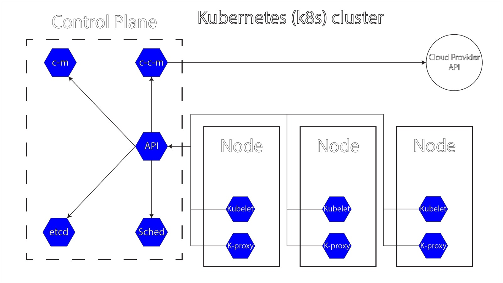

# Kubernetes Cluster Overview
A Kubernetes cluster is a set of nodes that run containerized applications, providing a platform for automating the deployment, scaling, and operation of these applications across clusters of hosts. Kubernetes manages the lifecycle of containers, ensuring that the desired state of applications is maintained.

## Master Node (Control Plane)
The master node is responsible for managing the Kubernetes cluster, maintaining its desired state, and making decisions about scheduling, scaling, and updates.

### Components:

- API Server:  
The entry point for all REST commands used to control the cluster, serving the Kubernetes API and handling requests from clients and other components.

- Controller Manager:  
Watches the state of the cluster and makes or requests changes as needed (e.g., scaling replicas, managing nodes).

- Scheduler:  
Assigns work to worker nodes by placing pods based on resource availability and constraints.

- etcd:  
A distributed key-value store that stores all cluster data, configuration, and state, acting as the source of truth for the cluster.

- Cloud Controller Manager (CCM):  
Manages cloud-specific control logic, allowing Kubernetes to interact with the underlying cloud provider's API.

  Components:
  - Node Controller:  
Monitors the state of nodes and manages cloud resources, such as automatically registering new nodes.
  - Route Controller:  
Manages routes in cloud networking (e.g., routing tables in AWS or GCP).
  - Service Controller:  
Handles the lifecycle of services, ensuring they are correctly integrated with the cloud provider’s load balancer.
- ConfigMap (CM):  
A Kubernetes resource that stores non-sensitive configuration data in key-value pairs, enabling you to decouple configuration artifacts from container images.

  Use Cases:
  - Store configuration files or command-line arguments for applications.
  - Provide environment variables for containers.
  - Allow dynamic configuration changes without requiring redeployment.
  - Note: ConfigMaps are not suitable for sensitive data like passwords or API keys.

## Worker Nodes
Worker nodes run application workloads in the form of pods. Each worker node can host multiple pods.

### Components:

- Kubelet:  
An agent on each worker node that maintains the pods’ desired state as defined by the master node and communicates with the API server.
- Kube Proxy:  
Maintains network rules on the worker nodes and routes traffic to the appropriate pod, ensuring load balancing.
- Container Runtime:  
The software responsible for running containers (e.g., Docker, containerd), pulling images and running containers as specified by the kubelet.

## Networking
Networking is a critical aspect of Kubernetes that enables communication between various components and services within a cluster.

### Flannel:  
Flannel is a popular networking overlay solution for Kubernetes that provides an easy way to configure a Layer 3 network fabric for containers. It allows pods to communicate across different nodes by providing a virtual network.

Key Features:  
- Pod-to-Pod Communication:  
Ensures seamless communication between pods, even when they are on different nodes.
- Network Isolation:  
Offers network isolation between different namespaces, enhancing security.
- Integration with CNI:  
Works as a Container Network Interface (CNI) plugin, allowing Kubernetes to manage networking in a standardized way.

## Pods
Pods are the smallest deployable units in Kubernetes, encapsulating one or more containers that share the same network namespace and storage.

Characteristics:
- Each pod gets its own IP address and can communicate with other pods using this address.
- Pods can be managed and scaled by higher-level Kubernetes objects like Deployments and StatefulSets.

## Services
A service is an abstraction that defines a logical set of pods and a policy for accessing them, providing stable network endpoints and load balancing.

Types:
- ClusterIP:
Exposes the service on a cluster-internal IP, accessible only from within the cluster.
- NodePort:
Exposes the service on each node’s IP at a static port, accessible from outside the cluster.
- LoadBalancer:
Provisions a load balancer for the service, allowing external access.

## Ingress
Ingress is a Kubernetes resource that manages external access to services within a cluster, typically HTTP and HTTPS traffic. It provides a way to expose multiple services under a single IP address and route traffic based on defined rules.

Characteristics:
- Ingress Controller:  
A component that implements the Ingress resource, typically based on a reverse proxy (like Nginx, HAProxy, or Traefik).
- Routing:  
Allows traffic routing based on hostnames or paths, enabling multiple services to be accessed through a single external endpoint.
- TLS Termination:  
Supports SSL/TLS termination, allowing secure communication over HTTPS.

## Deployments
Deployments manage the deployment of pods, ensuring the desired number of pod replicas are running and facilitating rolling updates and rollbacks.

Characteristics:  
Simplifies scaling, updating, and managing the lifecycle of applications.

## Namespaces
Namespaces provide a way to divide cluster resources among multiple users or applications, useful for organizing resources and avoiding name collisions.

Characteristics:
Each namespace can have its own set of resources, policies, and permissions.

### Conclusion
Kubernetes is a powerful orchestration platform that simplifies container management at scale. Understanding its architecture and the roles of its components can help you effectively deploy and manage your applications within a Kubernetes cluster. You can leverage its features for scaling, self-healing, and load balancing to ensure high availability and performance of your applications while seamlessly integrating with DevOps practices.

