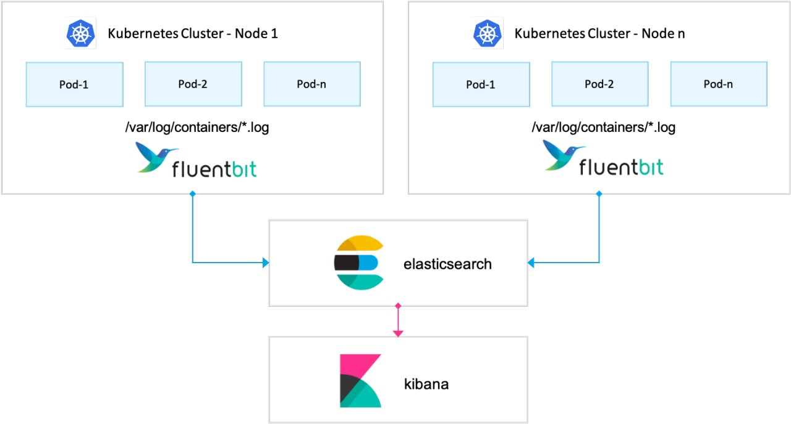

# Monitoring (Metrics and Logs)
Monitoring is a key practice in maintaining the health, stability, and performance of modern IT systems. It involves the continuous collection and analysis of metrics and logs, providing insight into both high-level performance trends and detailed system events. These two data types form the foundation for observability, which allows engineers to detect and resolve issues before they impact the system's users.

## Metrics
### What Are Metrics?
Metrics are numerical values that represent the state of a system or application over time. They are typically collected at regular intervals (e.g., every minute or second) and reflect aspects of system performance, resource usage, or business-level data. Examples include:

- CPU Usage: Percentage of CPU capacity being used by a service.
- Memory Usage: The amount of memory consumed by applications.
- Network Traffic: Volume of data transmitted or received over time.
- Request Latency: Time taken for a service to respond to a request.
- Number of Active Connections: Number of open connections to a service.

### How Metrics Are Collected
Metrics are usually gathered by exporters or agents running on system components. These agents pull or push metric data to a central metrics collection system like Prometheus. The metrics are stored in a time-series format, which makes it easy to query historical data and observe performance trends over time.

## Logs
### What Are Logs?
Logs are detailed records of events that occur in a system or application. These records are typically text-based and provide granular information about operations, state changes, errors, and warnings. Common log types include:

- Application Logs: Generated by the application code, detailing its operations (e.g., user login, data query).
- System Logs: Operating system-level events (e.g., process start/stop, system boot).
- Security Logs: Records of authentication attempts, access controls, and policy enforcement.
- Audit Logs: Tracks changes to system configurations or administrative actions.

### How Logs Are Collected
Logs can be collected by log forwarders such as Fluent Bit or FluentD. These tools aggregate logs from various sources, such as applications, containers, and the operating system, and then forward them to a centralized log storage system like Elasticsearch. Logs are often stored in a structured format, making them easier to search, filter, and analyze.

###  Metrics vs. Logs: Complementary Roles
- Metrics offer a high-level, real-time view of system health and performance but may lack context when something goes wrong.
- Logs offer detailed event data that can help diagnose the specific cause of issues but may be overwhelming without knowing where to look.  

By combining metrics and logs, you achieve observability, which allows for proactive monitoring and deep system understanding. Observability tools like Prometheus, Elasticsearch, and Grafana make it easier to visualize both metrics and logs for comprehensive system monitoring.

## Fluent Bit
Fluent Bit is a lightweight log processor and forwarder designed to efficiently collect and route logs from various sources. It is particularly well-suited for cloud environments like Kubernetes due to its low resource footprint. Fluent Bit aggregates logs from multiple sources, processes them, and forwards them to destinations like Elasticsearch, enabling centralized log management.

## Elasticsearch
Elasticsearch is a powerful search and analytics engine that stores and indexes large amounts of log data. It's designed for fast, real-time search and analysis, making it an essential component of log aggregation stacks. Elasticsearch is often used to query and analyze structured and unstructured logs, which helps engineers identify patterns, trace issues, and derive insights from massive amounts of log data.

## Kibana
Kibana is a data visualization tool that works alongside Elasticsearch. It allows users to create interactive dashboards and visualize log data in meaningful ways. With Kibana, logs stored in Elasticsearch can be explored through customized dashboards that help engineers monitor systems, analyze trends, and investigate issues in real time.

## Prometheus
Prometheus is an open-source tool designed to collect and store metrics from applications and infrastructure. It gathers time-series data and supports querying and alerting. Prometheus is widely used in cloud-native environments, such as Kubernetes, where it scrapes metrics from various system components and provides real-time insights into performance and system health. It also supports customizable alert rules, triggering notifications when certain conditions, like high CPU usage, are met.

## Grafana
Grafana is a visualization platform that integrates with tools like Prometheus and Elasticsearch to provide a comprehensive view of both metrics and logs. Grafana allows users to create dashboards that display real-time metrics and logs, offering a unified monitoring platform. It also supports alerts, making it a key tool for tracking system performance and identifying issues quickly.

Together, these tools provide a robust monitoring solution for tracking and maintaining the health of systems and applications in complex environments.