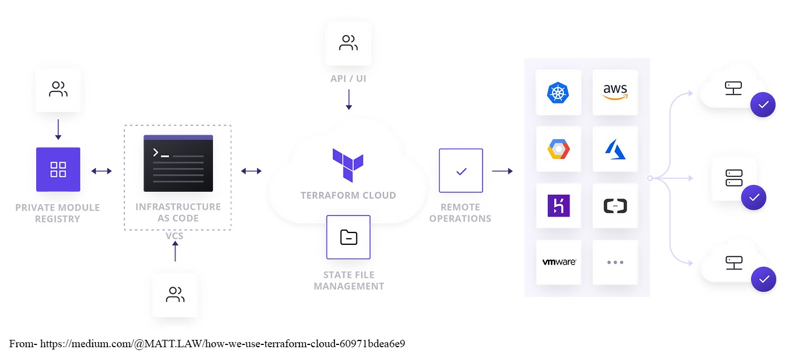

# Terraform overview
Terraform is an open-source infrastructure as code (IaC) tool developed by HashiCorp. It allows users to define and provision infrastructure using a declarative configuration language called HashiCorp Configuration Language (HCL) or JSON. With Terraform, users can create, manage, and version infrastructure resources across various cloud providers and services in a consistent manner.

## Key Features of Terraform
- Infrastructure as Code:  
Terraform allows users to define their infrastructure in code, making it easy to version, share, and manage infrastructure configurations. 

- Provider Ecosystem:  
Terraform supports a wide range of cloud providers (e.g., AWS, Azure, Google Cloud) and services through its provider plugins, enabling users to manage a diverse set of resources.

- State Management:  
Terraform maintains a state file that keeps track of the current state of the infrastructure. This state file is crucial for determining changes needed to reach the desired state defined in the configuration files.

- Execution Plans:  
Before applying changes, Terraform generates an execution plan that outlines what actions will be taken to achieve the desired state. This helps users understand the impact of changes before they are applied.

- Resource Graph:  
Terraform builds a dependency graph of resources to optimize resource creation and deletion. This allows for parallel operations and efficient management of resources.

- Modules:  
Terraform supports reusable modules, which are collections of Terraform configuration files that encapsulate best practices and can be shared across projects.

## Key Concepts in Terraform
- Providers: 
Providers are plugins that interact with cloud services, enabling Terraform to manage resources. Each provider offers resources that can be defined in configuration files.

- Resources: 
The fundamental building blocks in Terraform, resources represent cloud components such as virtual machines, storage buckets, and networking configurations. Each resource is defined with specific attributes in configuration files.

- Variables: 
Variables allow users to parameterize their configurations, enabling flexibility and reusability. They can be defined in .tf files or passed through command-line arguments.

- State File: 
The state file (terraform.tfstate) records the current state of the infrastructure managed by Terraform. It helps Terraform determine the necessary actions to achieve the desired state.

- Modules: 
Modules are reusable containers for multiple resources that are used together. They help organize and manage complex infrastructure setups.

- Outputs: 
Outputs are used to extract information from the resources created by Terraform. This can include resource IDs, IP addresses, or any other valuable data.

## Basic Workflow
- Write:  
Users define their infrastructure using HCL in .tf files.
- Initialize:  
Run terraform init to initialize the working directory and download necessary providers.
- Plan:  
Execute terraform plan to generate an execution plan, showing what changes will be made.
- Apply:  
Run terraform apply to apply the changes and create or update resources in the cloud.
- Destroy:  
Use terraform destroy to remove all resources managed by Terraform.

### Conclusion
Terraform is a powerful tool for managing infrastructure as code, offering a consistent and efficient way to provision and maintain resources across various cloud environments. Its declarative language, provider ecosystem, and state management capabilities make it a popular choice for DevOps and infrastructure teams. By using Terraform, organizations can achieve better control, repeatability, and collaboration in their infrastructure management processes.